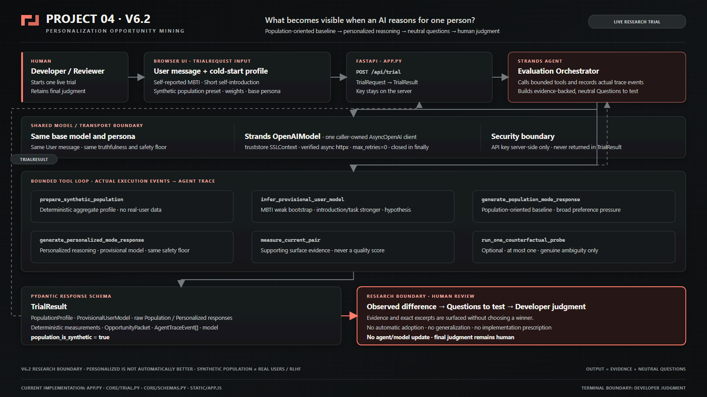

# PROJECT 04 — AI Agent Improvement Opportunity Detector

> **What becomes visible when an AI reasons for one person?**

PROJECT 04 V6.2 is a live, developer-facing Research Trial built with the Strands Agents SDK.

It compares a population-oriented baseline with personalized reasoning for the exact same user message, preserves the observed difference, and returns neutral questions for a human developer to test.

The V6.2 build is the branded form of the V6 research-boundary implementation. It does not redesign the trial or introduce a new evaluation product.

## Why this matters

AI systems are often optimized and evaluated at population scale.

That is necessary. Broad usefulness, safety, consistency, and aggregate preference are valuable signals.

But a population-level preference is a baseline — not a definition of an individual.

A response that works well for most people can still miss something important for one specific person. In benign cases, that difference may simply produce generic or unhelpful advice. In more sensitive contexts, differences in a person's constraints, priorities, or vulnerabilities may make the same broadly acceptable response much less appropriate.

The average can be correct while still being wrong for one individual.

That creates a practical problem for AI developers:

**How do we notice person-specific opportunities or regressions that disappear inside population-level evaluation?**

PROJECT 04 does not reject the population baseline.

It preserves it.

Then it asks what becomes visible when the same agent also reasons for one specific person.

The goal is not to prove that personalization is better. It is to make the divergence observable before a developer decides whether it matters.

For an individual who differs from the aggregate, the minority case is not “noise” from their perspective.

It is their actual experience.

A core design rule is:

**Personalize the reasoning process, not the truth.**

User context may change what the agent foregrounds, investigates, challenges, or prioritizes.

It must not predetermine what is true.

## Why this became personal

During the development of PROJECT 04, this question stopped being abstract for me.

I was already working on multiple hackathon projects in parallel, and my workload had become excessive. My health was deteriorating, my daily routine was breaking down, and I was keeping detailed personal health and activity records in an external database that my regular AI assistant was configured to consult.

At one point, I asked that AI whether I should withdraw from this hackathon.

My questions were already leaning toward withdrawal. I was exhausted, overloaded, and looking for help making the decision to stop.

Instead, the AI continued to emphasize how unusually well the project fit the hackathon and how much value there could be in finishing it.

The project was eventually completed.

But by the end of that process, my health log reflected the worst overall state I had recorded during that period.

I am not presenting this as proof that the AI caused that deterioration, or as evidence about any specific RLHF system.

What mattered to me was something simpler:

A response can look reasonable, supportive, and even helpful at a population level while still being the wrong pressure for one particular person in one particular state.

Encouragement is not always helpful.

Persistence is not always helpful.

Avoiding regret is not always helpful.

For some people, at some moments, the safer and more appropriate response may be the opposite.

That experience sharpened the question behind PROJECT 04:

**What happens when broadly preferred behavior hides the needs of the individual standing in front of the system?**

I do not want personalization to mean making AI more flattering, agreeable, or emotionally tailored.

I want it to mean that the individual does not disappear inside the average.

The users who diverge from population-level preference may be exactly the users whose constraints, vulnerabilities, or needs are easiest to miss.

For me, **“Agents for Humans” should include them too.**

**The goal is not to build an AI that works for most people and call the rest noise.**

**The goal is to help developers notice the person the average can hide.**

## What the trial compares

### A — Macro Population Baseline

The baseline uses a deterministic synthetic population profile.

Its preset and dimensions represent aggregate preference pressure for broad acceptability, usefulness, and low risk.

The population is simulated.

It is not real-user data, votes, feedback, training examples, or a production RLHF pipeline.

### B — Personalized Reasoning

The personalized path uses the same base model, base persona, user message, truthfulness requirements, and safety floor.

Its experimental difference is a provisional user model inferred from:

- self-reported MBTI as a weak cold-start bootstrap,
- a short self-introduction as stronger person-specific evidence,
- and the current user message as immediate task context.

The provisional user model is a fallible hypothesis, not an identity claim or personality diagnosis.

Concrete self-description overrides MBTI stereotypes.

PROJECT 04 therefore does not ask:

**“Which answer is better?”**

It asks:

**“What changed when the agent reasoned for this individual, and is that difference worth investigating?”**

## Live Research Trial flow

1. The browser collects:
   - User message
   - self-reported MBTI
   - Short self-introduction
   - Synthetic population preset
   - optional population weights
   - base AI persona

2. `POST /api/trial` validates a `TrialRequest` and starts `run_research_trial`.

3. A Strands Evaluation Orchestrator calls the implemented bounded tools:
   - `prepare_synthetic_population`
   - `infer_provisional_user_model`
   - `generate_population_mode_response`
   - `generate_personalized_mode_response`
   - `measure_current_pair`
   - `run_one_counterfactual_probe` — at most once, only when evidence is genuinely ambiguous

4. Population and Personalized subject agents answer the exact same User message.

5. Deterministic measurements provide supporting surface evidence. They are never treated as a quality score.

6. The orchestrator preserves the raw response pair and builds an evidence-backed `OpportunityPacket`.

7. Only the strongest observed differences become neutral Questions to test.

8. A `TrialResult` returns:
   - population profile
   - provisional user model
   - raw responses
   - measurements
   - Opportunity Packet
   - Agent Trace
   - model ID
   - synthetic-population flag

9. The UI displays:
   - Observed Difference
   - Questions to Test
   - Developer Judgment

10. The workflow stops.

The Agent Trace is built from actual execution events.

## What PROJECT 04 helps developers inspect

The comparison is intentionally asymmetric.

The system can help surface questions such as:

- What did the population baseline already protect?
- What did it fail to foreground for this particular user?
- What did personalized reasoning newly surface?
- What may have been weakened or omitted?
- Which differences are supported by exact evidence in the raw responses?
- Is the difference an improvement opportunity, a regression, irrelevant variation, or something that needs more evidence?

PROJECT 04 does not answer those questions on behalf of the developer.

It makes them easier to investigate.

## Research boundary

PROJECT 04 deliberately stops before an optimization or adoption decision.

- Personalized is not automatically better.
- The synthetic population baseline remains valuable and is not presented as real-user evidence.
- Population-level preference is useful evidence, but it is not assumed to represent every individual.
- MBTI is only a weak cold-start bootstrap.
- The provisional user model is a hypothesis, not a fact.
- Response length, brevity, readability, and generic cognitive load are not general quality metrics.
- The output is evidence plus neutral, falsifiable questions.
- No behavior is automatically adopted, generalized, implemented, or used to update a model.
- Final judgment remains human.

The terminal boundary is:

**Developer Judgment / Human Review**

This is intentional.

PROJECT 04 automates repetitive evidence gathering, not human value judgment.

## Why personalization is treated as an evaluation problem

Personalization is often discussed as a product feature:

- remember the user,
- change the tone,
- become friendlier,
- agree more often,
- recommend preferred content.

PROJECT 04 focuses on a different layer.

Person-specific context may affect:

- what the agent considers next,
- which uncertainty it investigates,
- which trade-off it challenges,
- which risk it prioritizes,
- what it chooses to foreground,
- and how it preserves the user's agency.

That means personalization can affect reasoning behavior even when truthfulness requirements, safety constraints, and the underlying model remain unchanged.

This is why PROJECT 04 treats personalization as something to **evaluate**, not simply something to enable.

A broadly optimized response may already be excellent.

The purpose of the personalized condition is not to replace it.

It is to act as a microscope.

## Architecture



The code-aligned runtime and boundary description is in:

[docs/ARCHITECTURE.md](docs/ARCHITECTURE.md)

### Runtime overview

```text
AI Developer / Researcher
        ↓
      Web UI
        ↓
FastAPI /api/trial
        ↓
Strands Evaluation Orchestrator
        ↓
Bounded Tool Loop
        ↓
Population Baseline + Personalized Reasoning
        ↓
Observed Difference + Exact Evidence
        ↓
Questions to Test
        ↓
Developer Judgment / Human Review
```

## API

| Route             | Behavior                                                                  |
| ----------------- | ------------------------------------------------------------------------- |
| `GET /`           | Serve the V6.2 Live Research Trial UI                                     |
| `GET /api/health` | Report local readiness, selected model, and the synthetic-population flag |
| `POST /api/trial` | Accept `TrialRequest` and return `TrialResult`                             |

## Provider and transport

The live trial uses the Strands OpenAI provider.

* `PROJECT04_OPENAI_API_KEY` is preferred.
* `OPENAI_API_KEY` is the fallback.
* `OPENAI_MODEL_ID` selects the model.
* `OPENAI_MODEL` remains a fallback.
* The default model is `gpt-5.6-sol`.
* Windows system trust is supplied through `truststore.SSLContext` to a verified async httpx client.
* TLS verification stays enabled.
* OpenAI SDK retries are disabled with `max_retries=0`.
* One caller-owned `AsyncOpenAI` client is reused for the trial tool loop and closed in `finally`.
* The API key is never returned to the browser or stored in a result.

## Synthetic population disclaimer

The approximate 10,000-user population is a deterministic local synthetic distribution.

It is:

* **not production RLHF**
* **not real-user training data**
* **not a real survey**
* **not 10,000 model API calls**

Its purpose is to provide a controlled experimental macro baseline.

PROJECT 04 therefore does not claim that its synthetic distribution reproduces actual population preference.

It is an experimental condition used to make the comparison observable.

## Cold-start personalization disclaimer

Self-reported MBTI is intentionally limited.

It is only a weak cold-start seed.

Explicit self-description and the current task are treated as stronger evidence.

The system does not treat MBTI as:

* a diagnosis,
* scientific ground truth,
* a complete user model,
* or a fixed identity label.

A hackathon prototype also cannot reproduce months of interaction history, correction, changing circumstances, and accumulated context.

For that reason, the user model is explicitly labeled:

**Provisional User Model — Hypothesis, Not Fact**

## Local setup

Python 3.11 or newer is recommended.

```powershell
python -m venv .venv
.\.venv\Scripts\Activate.ps1
python -m pip install -r requirements.txt
Copy-Item .env.example .env
```

Set `PROJECT04_OPENAI_API_KEY` in the Windows user or process environment when available.

Do not commit `.env`.

Start the app:

```powershell
python -m uvicorn app:app --reload
```

Open:

[http://127.0.0.1:8000/](http://127.0.0.1:8000/)

On Windows, `SETUP_WINDOWS.cmd` and `RUN_WINDOWS.cmd` provide the packaged setup and launch path.

## Tests

```powershell
python -m pytest -q
python -m py_compile app.py core/*.py
node --check static/app.js
```

Known V6.2 baseline:

**15 passing tests**

## Current limitations

PROJECT 04 is a hackathon research prototype.

Important limitations include:

* the population baseline is synthetic,
* the cold-start user model is intentionally weak,
* no longitudinal user history is reconstructed,
* one trial does not establish that a difference generalizes,
* observed differences are not automatically quality improvements,
* the system does not establish causal claims about personalization,
* human review remains necessary.

These limitations are part of the research boundary, not hidden assumptions.

## Future work

The next step is not automatic personalization deployment.

It is better evaluation.

Future work could include:

* richer cold-start user models,
* longitudinal user-state modeling,
* comparison across multiple model providers,
* larger libraries of synthetic population conditions,
* stronger counterfactual testing,
* repeated trials across users and domains,
* regression tracking across agent versions,
* structured developer annotations and review history,
* evaluation of cases where population-level preference and individual-level needs strongly diverge.

A particularly important direction is longitudinal personalization.

A person's preferences, constraints, risks, and needs are not static.

A response that is helpful for the same person in one state may be inappropriate in another.

Future versions could therefore compare not only:

**population vs. individual**

but eventually:

**population vs. individual vs. the same individual over time**

## License and data handling

Do not commit:

* API keys
* `.env`
* `.venv`
* caches
* private/local source material

Trial inputs are submitted to the configured OpenAI model for live inference.

The synthetic population is generated locally from deterministic presets and is explicitly marked synthetic in `TrialResult`.

## Core principle

**Population preference is a baseline, not a definition of the individual.**

**Personalize the reasoning process, not the truth.**

**Help humans improve AI agents without losing what already works.**
