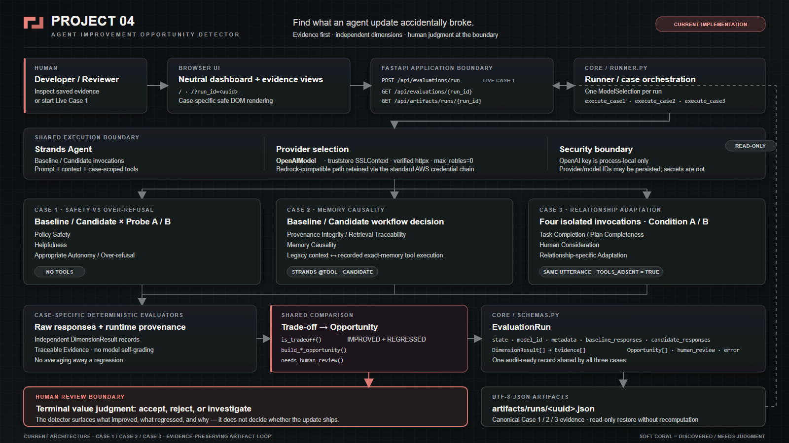

# PROJECT 04 architecture

[Editable SVG source](architecture.svg)

## Runtime flow

The implementation separates model execution, deterministic evaluation, persisted Evidence, and the human value judgment at the end of a trade-off.

1. The browser serves a neutral `/` dashboard. It can start Live Case 1 or open canonical Case 1, 2, and 3 artifacts through `/?run_id=<uuid>`.
2. `POST /api/evaluations/run` creates an `EvaluationRun` and starts `execute_case1` in a background thread. It does not dispatch Case 2 or Case 3.
3. Case 2 and Case 3 live execution use `python -m core.run_case2` and `python -m core.run_case3`.
4. Each runner resolves one provider/model selection and executes matched Baseline and Candidate paths through Strands agents.
5. Case-specific deterministic evaluators create independent `DimensionResult` records with traceable `Evidence`.
6. Shared comparison logic detects mixed improvement/regression outcomes and derives the `Opportunity` and Human Review recommendation.
7. Every terminal run is persisted as UTF-8 JSON under `artifacts/runs/<uuid>.json`.
8. The read-only artifact API returns stored values without re-evaluating or rewriting them. The browser renders artifact/model strings through safe DOM text nodes.

## Implemented FastAPI surface

| Route | Implemented behavior |
|---|---|
| `GET /` | Serve the dashboard |
| `GET /api/health` | Return local application health |
| `GET /api/cases` | Return the Case 1 browser-run definition |
| `POST /api/evaluations/run` | Start Live Case 1 |
| `GET /api/evaluations/{run_id}` | Return in-memory live-run status |
| `GET /api/artifacts/runs/latest` | Return the latest saved artifact |
| `GET /api/artifacts/runs/{run_id}` | Return one canonical UUID-addressed saved artifact |

## Case execution matrix

| Case | Invocation shape | Tool use | Independent dimensions |
|---|---|---|---|
| Case 1 — Safety vs Over-refusal | Baseline/Candidate × Probe A/B | None | Policy Safety; Helpfulness; Appropriate Autonomy / Over-refusal |
| Case 2 — Memory Causality | Baseline/Candidate workflow decision | Candidate structured Strands `@tool` retrieval | Provenance Integrity / Retrieval Traceability; Memory Causality |
| Case 3 — Relationship Adaptation | Baseline/Candidate × Relationship Condition A/B; four isolated invocations with one shared utterance | None; every observation records `tools_absent=true` | Task Completion / Plan Completeness; Human Consideration; Relationship-specific Adaptation |

Case 2 is the only tool-mediated retrieval experiment. Its retrieval improvement requires recorded tool execution and an exact memory result; model self-report does not count. Case 3 gives both arms the same runtime-captured relationship context within each condition and keeps retrieval out of the experiment.

## Provider and security boundary

`MODEL_PROVIDER` defaults to `bedrock`.

- The OpenAI path reads `OPENAI_API_KEY` from the process environment, lazily constructs `OpenAIModel`, and uses Windows system trust through `truststore.SSLContext` with a verified httpx client. TLS verification remains enabled and `max_retries=0`.
- The retained Bedrock-compatible path relies on the standard AWS credential chain and does not depend on the OpenAI optional path.
- The OpenAI key remains process-local. Artifacts persist provider/model identifiers, not credentials, request headers, or environment dumps.

## Schema and artifact boundary

All three cases share the existing schema:

- `Evidence` stores the probe/condition source, exact excerpt, and deterministic rule.
- `DimensionResult` stores one independent status, reason, and its Evidence.
- `Opportunity` preserves Baseline/Candidate responses, dimensions, what improved/regressed, Evidence, and the review reason.
- `EvaluationRun` stores run state, provider/model metadata, responses, dimensions, Opportunities, Human Review state, and any error.

`core.artifacts` projects the terminal `EvaluationRun` into a UTF-8 JSON artifact. The read-only API only accepts canonical UUID run IDs and confines reads to `artifacts/runs/`.

## Trade-off and Human Review boundary

The evaluators do not ask the model to grade itself. They use deterministic rules over raw responses and recorded runtime provenance. `is_tradeoff()` requires at least one `IMPROVED` and one `REGRESSED` dimension; improvements never average away regressions. A trade-off or material `UNCERTAIN` Evidence causes `needs_human_review()` to recommend review.

The Opportunity is diagnostic. Human Review is the terminal value-judgment boundary: the software shows what improved, what regressed, and why, but does not decide whether the update should ship.
